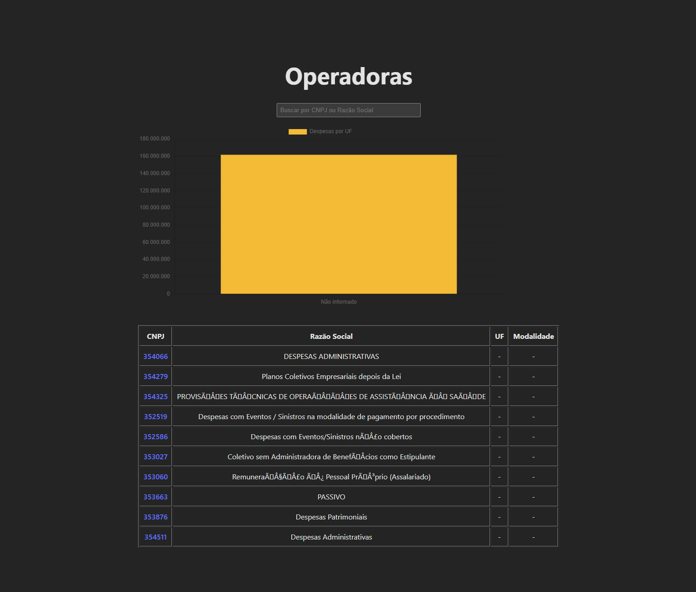
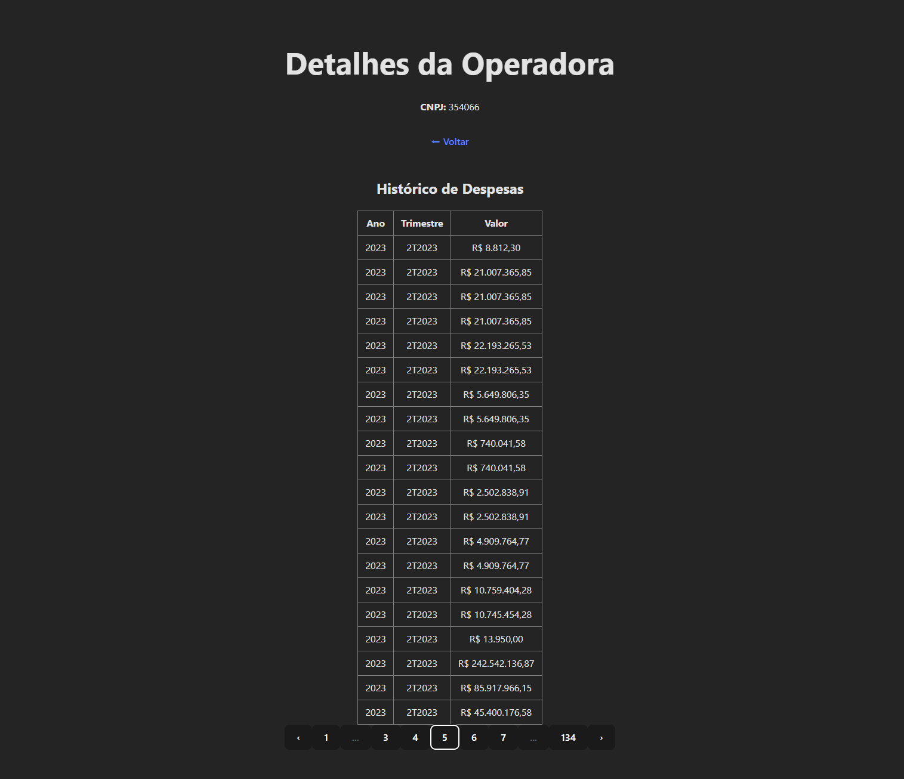

# Teste Técnico – ANS

Este projeto foi desenvolvido como parte de um teste técnico, com o objetivo de coletar, processar, analisar e visualizar dados públicos da ANS (Agência Nacional de Saúde Suplementar).

A solução contempla todo o fluxo de dados, desde a obtenção dos arquivos brutos, transformação e consolidação, até a disponibilização das informações por meio de uma API REST e uma interface frontend desenvolvida em Vue.js.

Ao longo do projeto, priorizei simplicidade, clareza e reprodutibilidade, documentando as principais decisões técnicas e trade-offs adotados durante o desenvolvimento.

## 📌 Navegação Rápida

- [🖥️ Funcionalidades Implementadas](#️-funcionalidades-implementadas)
- [👨🏾‍💻 Tecnologias Utilizadas](#tecnologias-utilizadas)
- [🧱 Estrutura do Projeto](#-estrutura-do-projeto)
- [👣 Etapas do Desenvolvimento](#-etapas-do-desenvolvimento)
- [🛠️ Trade-offs Técnicos](#️-trade-offs-técnicos)
- [▶️ Como Executar o Projeto](#️-como-executar-o-projeto)
- [🚀 Considerações Finais](#-considerações-finais)

## 📸 Interface da Aplicação

<p align="center">
  
  
</p>

<p align="center">
  <em>À esquerda: Page 1, com barra de Pesquida, Gráfico e Tabela. • À direita: Page 2, com Histórico de Despesas. Abre ao clicar no CNPJ da page 1.</em>
</p>

## 🖥️ Funcionalidades Implementadas

- **Listagem de operadoras:** <br>
  Exibição das operadoras em formato de tabela, consumindo os dados da API.

- **Paginação:** <br>
  A tabela possui paginação, permitindo navegar entre as páginas sem sobrecarregar a visualização ou a requisição de dados.

- **Busca e filtro:** <br>
  É possível buscar operadoras pelo CNPJ ou Razão Social, facilitando encontrar registros específicos de forma rápida.

- **Visualização gráfica:** <br>
  Implementação de um gráfico que mostra a distribuição das despesas por UF, ajudando na análise visual dos dados.

- **Detalhes da operadora:** <br>
  Cada operadora possui uma página de detalhes, onde é exibido o histórico de despesas ao longo dos trimestres.

- **Estados de loading e dados vazios:** <br>
   interface trata estados de carregamento e ausência de dados, exibindo mensagens claras para o usuário.

<a id="tecnologias-utilizadas"></a>
## 👨🏾‍💻 Tecnologias Utilizadas
Neste projeto utilizei as seguintes tecnologias e ferramentas:

- Backend
  - Python – linguagem principal do projeto
  - FastAPI – criação da API REST de forma simples e rápida
  - Uvicorn – servidor para execução da API
  - Pandas – leitura e manipulação dos arquivos CSV

- Banco de Dados
  - PostgreSQL – utilizado para criação das tabelas e execução das consultas SQL
  - SQL – scripts para análise e exploração dos dados

- Frontend
  - Vue.js – construção da interface web
  - JavaScript – lógica da aplicação no frontend
  - HTML e CSS – estrutura e estilização da interface
  - Chart.js – geração de gráficos para visualização das despesas por UF

- Ferramentas
  - Git e GitHub – controle de versão e organização do código
  - Postman – testes e validação das rotas da API

## 🧱 Estrutura do Projeto
O projeto foi organizado em pastas separadas por etapa, para facilitar o entendimento do fluxo completo, desde a coleta dos dados até a interface web.

- `01_api_ans`  
  Contém os scripts responsáveis por obter os dados da ANS, realizando o download dos arquivos utilizados no projeto.

- `02_transformacao_validacao`  
  Responsável pelo tratamento, limpeza e validação dos dados.
  Nesta etapa os arquivos são transformados para um formato mais simples de trabalhar (CSV) e preparados para as análises.

- `03_banco_dados`  
  Inclui os scripts SQL utilizados para:
    - Criar as tabelas
    - Importar os dados tratados
    - Executar consultas analíticas solicitadas no teste

- `04_api_web`  
  Contém a API desenvolvida com FastAPI, responsável por disponibilizar os dados para o frontend.
  A API fornece rotas para listagem de operadoras, detalhes e histórico de despesas.

- `05_frontend`  
  Interface desenvolvida com Vue.js, onde:
   - As operadoras são exibidas em tabela paginada
   - É possível buscar por CNPJ ou Razão Social
   - Os dados são visualizados em gráficos
   - Existe uma página de detalhes da operadora

- `data` 
  Diretório utilizado para armazenar os dados brutos e processados ao longo do pipeline, servindo de base para as etapas seguintes do projeto.

## 👣 Etapas do Desenvolvimento

### 1.1 Coleta dos Dados
Os dados foram obtidos a partir das Demonstrações Contábeis disponibilizadas pela ANS.

Inicialmente considerei a listagem automática dos arquivos via FTP, porém identifiquei instabilidades no servidor (erros de listagem e sensibilidade a maiúsculas/minúsculas).

Para garantir uma solução simples e estável, optei pelo download direto dos arquivos a partir de seus nomes conhecidos, seguindo o padrão oficial da ANS (ex: `4T2023.zip`).  
Os arquivos são armazenados no diretório `data/raw`.

---

### 1.2 Transformação Inicial dos Dados
Após o download, os arquivos ZIP foram extraídos e convertidos para o formato CSV.

Optei por trabalhar diretamente com arquivos CSV ao longo do pipeline, priorizando simplicidade, legibilidade e compatibilidade com as etapas seguintes, considerando o prazo e o escopo do desafio.

---

### 1.3 Consolidação e Análise de Inconsistências
Os dados dos trimestres analisados foram consolidados em um único arquivo (`consolidado_despesas.csv`), contendo as colunas exigidas pelo teste:
- CNPJ  
- RazaoSocial  
- Trimestre  
- Ano  
- ValorDespesas  

Durante a consolidação, tratei as seguintes inconsistências:
- Valores zerados ou negativos foram descartados
- Datas em formatos inconsistentes foram convertidas com tolerância a erro
- O campo `REG_ANS` foi utilizado como identificador temporário de operadora, o que foi documentado como uma limitação dos dados disponíveis

---

### 2.1 Limpeza e Padronização dos Dados
Os valores monetários, originalmente representados como texto com separador decimal em vírgula, foram limpos e convertidos explicitamente para formato numérico.

Também realizei padronizações de tipos de dados e remoção de registros inválidos, garantindo maior consistência para as análises posteriores.

---

### 2.2 Enriquecimento dos Dados com Cadastro de Operadoras
Os dados consolidados de despesas foram enriquecidos com informações cadastrais das operadoras ativas da ANS.

Realizei um join utilizando o CNPJ como chave, adicionando as colunas RegistroANS, Modalidade e UF. O processo foi documentado considerando casos de ausência ou duplicidade de CNPJ no cadastro oficial.

---

### 2.3 Agregação de Despesas por Operadora e UF
Os dados enriquecidos foram agregados por RazaoSocial e UF, conforme solicitado no teste.

Para cada grupo, foram calculados:
- Total de despesas
- Média de despesas por trimestre
- Desvio padrão das despesas, com o objetivo de identificar variações significativas nos valores

O resultado foi ordenado pelo total de despesas (do maior para o menor) e salvo no arquivo `despesas_agregadas.csv`.

Essa etapa reduz significativamente o volume de dados, transformando registros individuais em informações consolidadas e mais adequadas para análise.

---

### 3. Escolha do banco de dados
Optei por usar PostgreSQL em vez de MySQL porque ele é mais flexível para análises, lida melhor com consultas mais complexas e tem suporte mais completo a funções analíticas.

Para este teste, onde o foco está em análise de dados e queries mais elaboradas, o PostgreSQL se mostrou mais adequado e simples de trabalhar.

---

### 3. Banco de Dados e Análise SQL
Criei scripts SQL compatíveis com PostgreSQL para estruturar o banco de dados, importar os arquivos CSV gerados nas etapas anteriores e responder às consultas analíticas solicitadas no teste.

Os scripts incluem:
- Criação das tabelas com tipos de dados e índices apropriados
- Exemplos de importação dos dados a partir dos arquivos CSV
- Queries analíticas para análise de crescimento de despesas, distribuição por UF e comparação com médias

---

### 4.2 Backend – API com FastAPI
Implementei uma API REST utilizando FastAPI para disponibilizar os dados processados nas etapas anteriores.

A API consome diretamente os arquivos CSV gerados no pipeline, evitando a necessidade de configurar um banco de dados em produção, o que facilita a execução e validação do projeto por quem for avaliá-lo.

#### Rotas disponíveis
- **GET /api/operadoras**  
  Lista as operadoras com paginação (`page` e `limit`).

- **GET /api/operadoras/{cnpj}**  
  Retorna os dados cadastrais de uma operadora específica.

- **GET /api/operadoras/{cnpj}/despesas**  
  Retorna o histórico de despesas da operadora ao longo dos trimestres.

- **GET /api/estatisticas**  
  Retorna estatísticas agregadas:
  - Total geral de despesas
  - Média das despesas
  - Top 5 operadoras com maiores despesas

A documentação interativa da API está disponível automaticamente via Swagger em `/docs`.

---

### Observação sobre encoding dos dados
Os dados utilizados neste projeto são provenientes de arquivos públicos da ANS, disponibilizados em formato CSV com encoding inconsistente.

Durante o desenvolvimento, realizei tentativas de normalização de encoding para UTF-8, porém alguns registros de texto podem ainda apresentar caracteres especiais incorretos na visualização.

Este comportamento não afeta o funcionamento da API nem a integridade dos dados, sendo apenas uma limitação estética do dataset original.

---

### Estratégia de Busca/Filtro:
Optei pela busca no cliente (frontend), pois o backend já retorna os dados de forma paginada, reduzindo o volume de dados carregados por requisição. Essa abordagem melhora a experiência do usuário ao permitir filtros instantâneos sem novas chamadas à API, além de simplificar a implementação.

---

### 4.3 Frontend – Interface em Vue.js
Implementei o frontend utilizando Vue.js, conforme solicitado no teste, com foco em apresentar os dados da API de forma clara e funcional.
Nesta etapa desenvolvi:

- Uma tabela paginada exibindo as operadoras
- Busca e filtro por Razão Social ou CNPJ
- Um gráfico com a distribuição das despesas por UF, utilizando biblioteca de gráficos
- Uma página de detalhes da operadora, mostrando o histórico de despesas ao longo do tempo
- O frontend consome diretamente as rotas da API desenvolvida no backend, mantendo a separação de responsabilidades entre interface e dados.

---

### Interface e Experiência do Usuário - O que eu planejava fazer... 
Como etapa final planejada, considerei a evolução da estilização da interface, incluindo:
- Padronização visual com temas (Light, Dark e Dark Amber)
- Melhoria de responsividade para dispositivos móveis
- Refinamento visual da tabela, paginação e gráficos

Essas melhorias visam tornar a aplicação mais agradável visualmente, mantendo a simplicidade e usabilidade.

## 🛠️ Trade-offs Técnicos

### 1.2 Download direto dos arquivos em vez de listagem automática
A listagem dinâmica via FTP foi descartada devido a instabilidades encontradas durante os testes.

O download direto pelos nomes conhecidos reduz a complexidade da solução e aumenta a confiabilidade, ao custo de exigir atualização manual caso o padrão dos arquivos seja alterado.

---

### 2.1 Leitura de dados com tolerância a inconsistências
Durante a leitura dos arquivos CSV, identifiquei linhas com formato inconsistente.

Em vez de interromper o processamento, optei por permitir o descarte dessas linhas, priorizando a continuidade do pipeline e a robustez da solução, mesmo com a perda de alguns registros problemáticos.

### 2.1 Conversão explícita de valores monetários
Escolhi realizar a conversão manual dos valores monetários para formato numérico, em vez de depender de configurações de locale.

Essa decisão torna o processamento mais previsível, independente do ambiente de execução e mais seguro para análises e agregações futuras.

---

### 2.2 Estratégia de join e tratamento de inconsistências no cadastro de operadoras
Durante o enriquecimento dos dados, foi necessário realizar um join entre o arquivo consolidado de despesas e o cadastro de operadoras ativas da ANS, utilizando o CNPJ como chave.

Optei por utilizar um left join, garantindo que todos os registros de despesas fossem preservados, mesmo quando não houvesse correspondência no cadastro de operadoras.

Para tratar inconsistências:
- CNPJs sem correspondência no cadastro foram mantidos, com campos de cadastro nulos
- CNPJs duplicados no cadastro foram resolvidos mantendo apenas um registro por CNPJ

Essa abordagem prioriza a integridade dos dados financeiros e evita a perda de informações relevantes, ao custo de manter registros parcialmente enriquecidos, o que considerei aceitável para fins analíticos.

---

### 2.3 Estratégia de agregação e ordenação dos dados
Para a etapa de agregação, optei por realizar os cálculos diretamente utilizando operações de groupby no Pandas, considerando o volume atual dos dados e o escopo do desafio.

Essa abordagem simplifica a implementação, mantém o código legível e apresenta boa performance para o tamanho do dataset utilizado.

A ordenação foi realizada em memória, priorizando clareza e rapidez de desenvolvimento. Em cenários com volumes significativamente maiores, estratégias como processamento incremental ou uso direto de banco de dados seriam consideradas.

---

### 3.2 Normalização e escolha de tipos de dados
Optei por manter tabelas separadas para despesas, operadoras e dados agregados, em vez de utilizar uma única tabela desnormalizada.

Essa abordagem reduz redundância, deixa o modelo mais organizado e facilita consultas analíticas, mesmo aumentando um pouco a complexidade das queries.

Para valores monetários, escolhi o tipo DECIMAL, priorizando precisão nos cálculos financeiros em vez de performance extrema.

---

### 3.4 Estratégia das queries analíticas
Optei por construir as queries utilizando CTEs (Common Table Expressions), pois deixam o código mais legível e fácil de entender.

Mesmo existindo formas mais curtas de escrever algumas consultas, priorizei clareza e manutenibilidade, pensando em quem irá avaliar ou dar manutenção no código.

---

### 4.2 – Backend

#### 4.2.1. Escolha do Framework
Optei por utilizar FastAPI por ser simples de configurar, ter ótima performance e já fornecer documentação automática das rotas via Swagger.

Para o escopo do teste, ele entrega mais produtividade e facilidade de testes do que o Flask, sem adicionar complexidade desnecessária ao projeto.

---

#### 4.2.2. Estratégia de Paginação
Foi utilizada paginação baseada em offset, com os parâmetros page e limit.

Essa abordagem é simples de implementar, fácil de entender e atende bem ao volume de dados utilizado no projeto, além de facilitar o consumo no frontend.

---

#### 4.2.3. Cache vs Queries Diretas
Para a rota /api/estatisticas, optei por calcular os dados diretamente a partir dos arquivos CSV a cada requisição.

Como os dados não sofrem atualizações frequentes e o volume é controlado, essa abordagem mantém o código mais simples e evita a necessidade de camadas extras de cache ou pré-processamento.

Em um cenário de produção com alto volume ou múltiplas requisições simultâneas, o uso de cache ou dados pré-calculados seria mais indicado.

---

#### 4.2.4. Estrutura de Resposta da API
As rotas paginadas retornam dados acompanhados de metadados, no formato:
```bash
{
  "data": [...],
  "page": 1,
  "limit": 10,
  "total": 100
}
   ```
Essa estrutura facilita a implementação da navegação no frontend e torna a API mais clara e fácil de consumir.

---

### 4.3.1. Estratégia de Busca/Filtro
Para a busca de operadoras, optei por fazer o filtro no frontend.

Os dados já são carregados da API e a busca acontece diretamente na lista, o que deixa a resposta mais rápida para o usuário e evita várias chamadas ao backend.

Como o volume de dados não é muito grande, essa abordagem funciona bem. Em um cenário com muitos registros, a busca no servidor seria mais indicada.

---

### 4.3.2. Gerenciamento de Estado
Para gerenciar os dados no frontend, utilizei estado local dos componentes e props, sem usar Vuex ou Pinia.

A aplicação é simples e não possui muitos dados compartilhados entre telas, então não vi necessidade de adicionar uma ferramenta mais complexa.

Essa escolha deixou o código mais fácil de entender e manter.

---

### 4.3.3. Performance da Tabela
Para melhorar a performance e a usabilidade da tabela, implementei paginação, exibindo apenas parte dos registros por vez.

Isso evita carregar muitos dados na tela ao mesmo tempo e melhora a navegação do usuário.

---

### 4.3.4. Tratamento de Erros e Loading
A aplicação trata os principais estados da interface:

- Loading: enquanto os dados estão sendo carregados
- Erro: quando ocorre algum problema na requisição
- Lista vazia: quando não há dados para exibir

Optei por mostrar mensagens simples e claras para que o usuário entenda facilmente o que está acontecendo.

---

## ▶️ Como Executar o Projeto

1. Clone o repositório e acesse o diretório do projeto.
   ```bash
   git clone <url-do-repositorio>
   cd Teste_DeyvissonRobert 
   ```
2. Crie e ative um ambiente virtual Python.
    ```bash
    python -m venv venv
   ```
     Windows
       ```bash
        venv\Scripts\activate
       ```
    Linux / Mac
       ```bash
        source venv/bin/activate
       ```
3. Instale as dependências necessárias.
    ```bash
    pip install pandas requests
   ```
4. Execute o script de download dos dados.
   ```bash
   python 01_api_ans/download_dados.py
   ```
5. Execute o script de processamento e consolidação.
   ```bash
   python 01_api_ans/processar_despesas.py
   ```
6. Execute o script de análise dos dados.
   ```bash
   python 01_api_ans/analise_despesas.py
   ```
7. Acesse o diretório da API Web.
   ```bash
   cd 04_api_web
   ```
> ⚠️ **Observação:** Certifique-se de que o ambiente virtual esteja ativo antes de iniciar a API,
> especialmente após acessar o diretório `04_api_web`, onde está o backend FastAPI.

8. Ative o ambiente virtual Python da API.
    ```bash
    python -m venv venv
   ```
     Windows
       ```bash
        venv\Scripts\activate
       ```
    Linux / Mac
       ```bash
        source venv/bin/activate
       ```
9. Instale as dependências do backend.
   ```bash
   pip install -r requirements.txt
   ```
10. Inicie a API com FastAPI.
   ```bash
   uvicorn app.main:app --reload
   ```
11. Acesse a documentação interativa da API no navegador.
   ```bash
   http://127.0.0.1:8000/docs
   ```

### ▶️ Executando o Frontend (Vue.js)

12. Em um **novo terminal** (mantendo a API rodando), acesse o diretório do frontend.
  ```bash
  cd 05_frontend
  ```
13. Instale as dependências do frontend.
   ```bash
   npm install
   ```
14. Inicie o servidor de desenvolvimento do Vue.js.
   ```bash
   npm run dev
   ```
15. Acesse o frontend no navegador.
   ```bash
   http://localhost:5173
   ```
> ⚠️ **Observação:** O backend (FastAPI) e o frontend (Vue.js) devem estar rodando simultaneamente em terminais separados para que a aplicação funcione corretamente.
   
## 🚀 Considerações Finais

Este projeto foi desenvolvido com foco em simplicidade, reprodutibilidade e clareza técnica, buscando atender aos requisitos do teste da forma mais organizada possível.

Ao longo do desenvolvimento, priorizei soluções que garantissem estabilidade do pipeline, facilidade de execução e boa experiência para quem for avaliar ou reproduzir o projeto, mesmo diante de limitações e inconsistências nos dados públicos disponibilizados pela ANS.

A solução final entrega um fluxo completo de coleta, processamento, consolidação, análise e visualização dos dados, acompanhado de uma API funcional, interface frontend em Vue.js e documentação clara sobre as decisões técnicas e trade-offs adotados.

Apesar do prazo curto, o desafio foi bastante enriquecedor. Durante os 7 dias de desenvolvimento do projeto proposto pelo teste, pude evoluir tecnicamente, reforçar conceitos importantes e me desenvolver ainda mais na construção de soluções completas, do backend ao frontend.
O frontend não consegui dar uma atenção maior e estilizar da forma que eu queria e gostaria por conta do prazo de entrega.

---

## ✨ Obrigado por ter chegado até aqui!  
Espero que este projeto ajude a demonstrar meu aprendizado, dedicação e evolução ao longo do desafio. 🙏🏾  
Fico à disposição para qualquer dúvida ou conversa. 😊🚀
